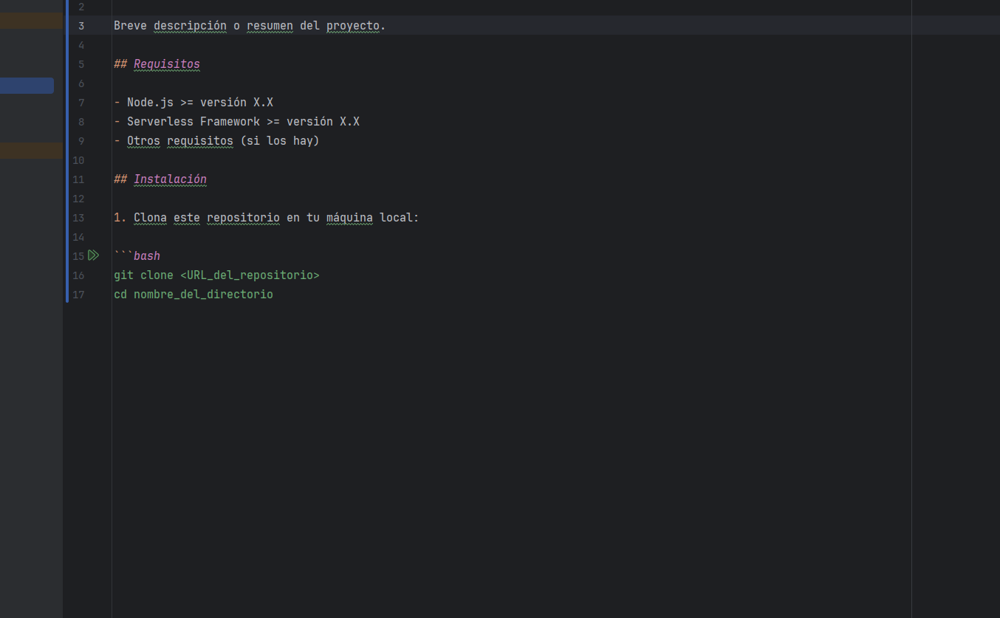

# Traductor de SWAPI

Breve descripción o resumen del proyecto.

## Requisitos

- Node.js >= versión X.X
- Serverless Framework >= versión X.X
- Otros requisitos (si los hay)

## Instalación

1. Clona este repositorio en tu máquina local:

```bash
git clone <URL_del_repositorio>
cd nombre_del_directorio
```

