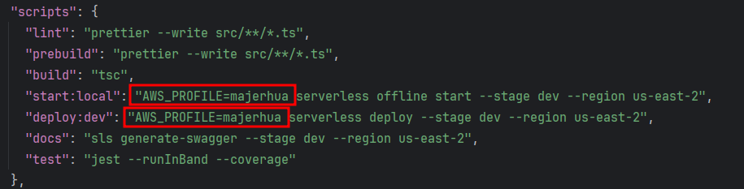

# Traductor de SWAPI

La API proporciona endpoints que permiten acceder a los datos de SWAPI traducidos al español, lo que facilita su uso
para usuarios de habla hispana. Los atributos
traducidos incluyen nombres de personajes, títulos de películas, nombres de planetas y más.

Por el momento solo está disponible los atributos de películas.

## Requerimientos.

- [x] Mínimo 2 endpoints, GET para recuperar la información y POST para crear un elemento
- [x] Integración con una base de datos (DynamoDB o MySQL)
- [x] Integración con SWAPI
- [x] Uso de Serverless Framework
- [x] Uso de Node.js
- [x] Respeto de las buenas prácticas de desarrollo
- [x] Traducción de campos de inglés a español

## Requisitos.

- Node.js >= versión 18.X
- Serverless Framework >= versión 3.38.0
- AWS cli >= 2.15.40
- TypeScript >= 5.4.2

## Funcionamiento
1. Listado de películas


Servicio que busca coincidencias en el título de la película. En primer lugar, realiza una 
consulta a la base de datos MySQL. Si la película buscada no existe, consulta la API de SWAPI 
para recuperar los valores de la película. Luego, mapea los atributos al español, los guarda en 
la base de datos y devuelve un listado de películas mapeadas al español.

2. Registro de película


El servicio registra una película verificando que no exista otra con el mismo ID.

3. Swagger
   [Enlace a la documentación Swagger](https://mwxhja001b.execute-api.us-east-2.amazonaws.com/dev/swagger)

## Arquitectura

1. La arquitectura utilizada fue la Arquitectura Hexagonal, también conocida como Arquitectura de Puertos y Adaptadores.

├── context
│   ├── film
│   │   ├── application
│   │   │   ├── create
│   │   │   │   └── FilmCreator.ts
│   │   │   └── get
│   │   │       └── FilmFilter.ts
│   │   ├── domain
│   │   │   ├── adapter
│   │   │   │   ├── paginate.dto.ts
│   │   │   │   └── responsePaginateFilm.ts
│   │   │   ├── FilmDirector.ts
│   │   │   ├── FilmEpisode.ts
│   │   │   ├── FilmExternalApiRepository.ts
│   │   │   ├── FilmId.ts
│   │   │   ├── FilmOpeningCrawl.ts
│   │   │   ├── FilmRepository.ts
│   │   │   ├── FilmTitle.ts
│   │   │   └── Film.ts
│   │   └── infrastructure
│   │       ├── controller
│   │       │   ├── CreateFilmController.ts
│   │       │   └── FilterFilmController.ts
│   │       ├── externalApi
│   │       │   └── SwapiFilmRepository.ts
│   │       ├── FilmRoutes.ts
│   │       └── persistence
│   │           ├── typeorm
│   │           │   └── film.entity.ts
│   │           └── TypeOrmFilmRepository.ts


2. Para los tests se ha utilizado el patrón de Object Mother, generando datos aleatorios con Faker.

test
├── context
│   └── film
│       ├── application
│       │   ├── FilmCreator.test.ts
│       │   └── FilmFilter.test.ts
│       ├── domain
│       │   ├── FilmDirectorMother.ts
│       │   ├── FilmEpisodeMother.ts
│       │   ├── FilmIdMother.ts
│       │   ├── FilmMother.ts
│       │   ├── FilmOpeningCrawlMother.ts
│       │   └── FilmTitleMother.ts
│       ├── infrastructure
│       │   ├── externalApi
│       │   │   └── SwapiFilmRepository.test.ts
│       │   └── persistence
│       │       └── TypeOrmFilmRepository.test.ts
│       └── __mocks__
│           ├── FilmExternalRepositoryMock.ts
│           └── FilmRepositoryMock.ts
└── shared
└── domain
├── IntegerMother.ts
├── MotherCreator.ts
└── WordMother.ts

## Instalación.

1. Clona este repositorio en tu máquina local:

```bash
git clone https://github.com/MajerhuaAyala/start-war.git
cd start-war
npm i
```

## Importante.

1. Cuenta de AWS: Esencial para el despliegue de la API. Si aún no tienes una, puedes crear una cuenta gratuita
   en [AWS](aws.amazon.com).
2. Cambiar el perfil de AWS, en el archivo packge.json remplazar con su perfil 
   {:target="_blank"}
## Primeros pasos.

### Crear un clouster de base de datos de prueba.

Crea un cluster de base de datos MySQL local o en un servicio.

### Editar las variables de entorno.

1. El archivo example.dev.json contiene variables de entorno con valores de ejemplo.
2. Crea un archivo env.dev.json en la misma ubicación que example.dev.json.
3. Agrega tus propias variables de entorno al archivo env.dev.json.

### Sincronización de tablas de base de datos.

1. Para sincronizar las tablas, debes editar el archivo
   /src/shared/infrastructure/persistence/typeorm/TypeOrmClientFactory.ts.
2. Editar el campo synchronize cambiar a valor true


### Pruebas locales.
Si quiere hacer pruebas sin desplegar siga los siguientes pasos
1. instale la extension serverless-auto-swagger y serverless-offline con los siguientes comandos

```bash
npm i -g serverless-offline serverless
serverless plugin install -n serverless-auto-swagger --stage dev 
serverless plugin install -n serverless-offline --stage dev 
```
2. Para levantar el servidos localmente ingrese el siguiente comando 

```bash
npm run build
npm run start:local
```
3. Se desplegarán los endpoints disponibles. Para hacer las pruebas, ingresa al siguiente endpoint.


## Test unitario e integración,
Para ejecutar los test ingrese los siguientes comandos

```bash
npm run test
```

Es importante tener en cuenta que las pruebas de integración no fallarán si tienes una 
conexión establecida a una base de datos y una URL válida de SWAPI.

## Despliegue a AWS.

1. Debe tener configurado su perfil de AWS
2. Correr las pruebas unitarias y integración
3. Transpilar de TypeScrip a JavaScript

```bash
npm run build
```
4. Desplegar a AWS

```bash
npm run deploy:dev
```